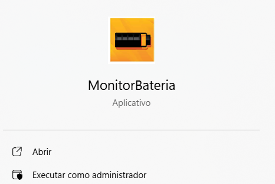
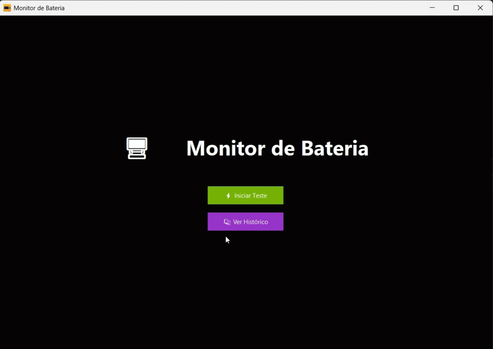
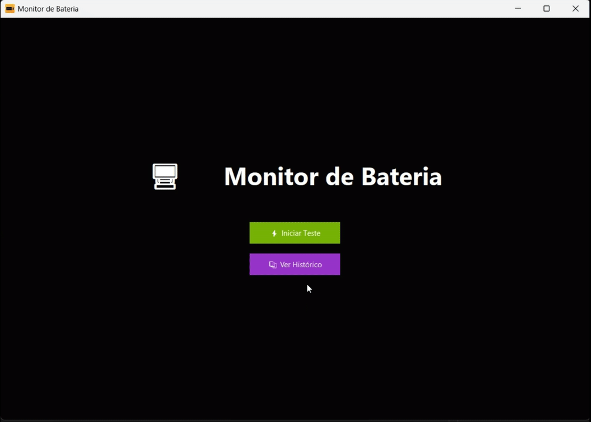
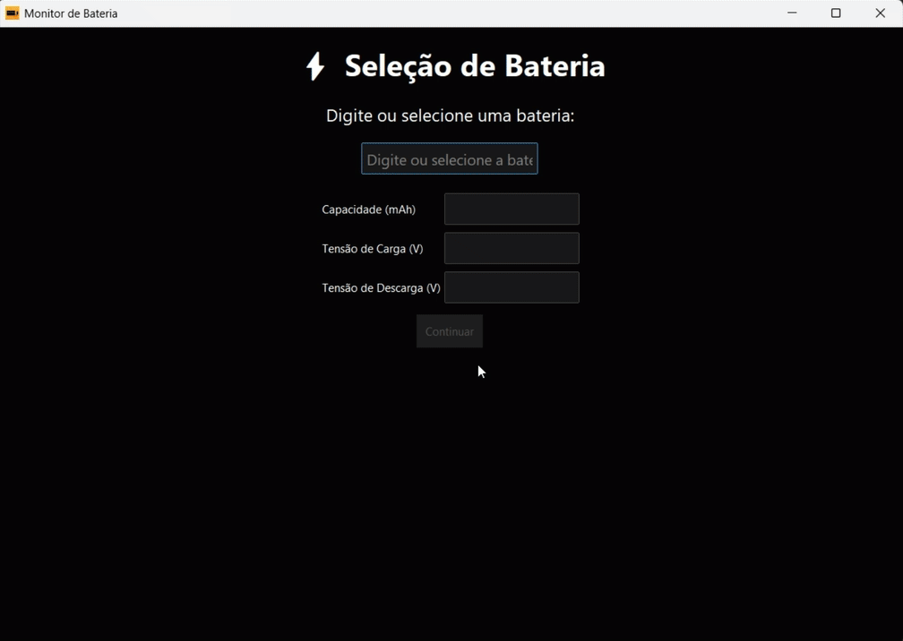
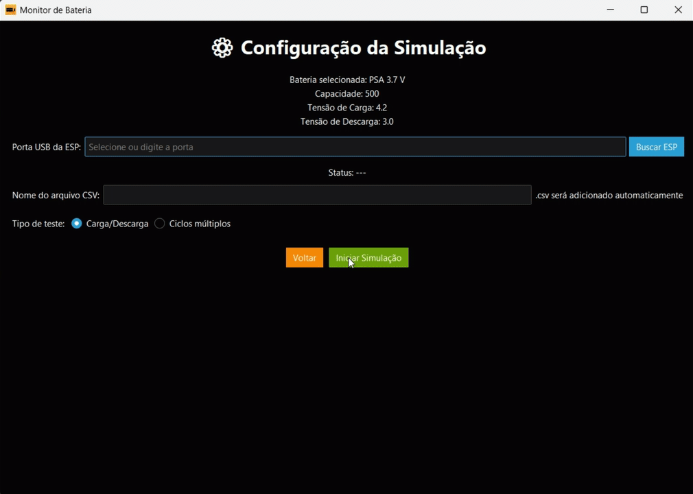
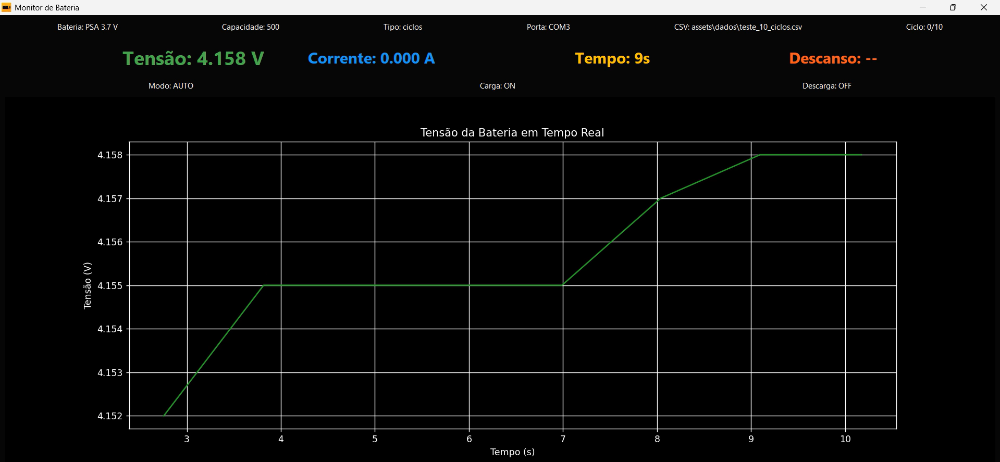

# Sistema de Medição Automatizada de Carga e Descarga de Baterias

Desenvolvido por Beatriz Paz Faria, Igor Budag de Oliveira, Júlia Espindola Steinbach e Lucas Costa Fontes.

## Guia de Software 

### 1. Introdução

O programa é coordenado pelo hardware do [datasheet](https://github.com/EngenhariaTelecom/projeto-integrador-03/tree/main/documentacao), simulando a medição automática da curva de carga e descarga de baterias e monitorando a tensão ao longo do tempo. A aplicação permite analisar o comportamento de baterias, facilitando a previsão de desempenho e a elaboração de relatórios automáticos com gráficos de tensão versus tempo.

### 2. Instalação e configuração
#### 2.1. Como instalar o executável
O primeiro passo para funcionamento do sistema é instalar o [executável](https://github.com/EngenhariaTelecom/projeto-integrador-03) disponível aqui no repositório do GitHub. Assim, um programa de monitoramento aparecerá em seu computador. Basta executá-lo como <u>Administrador</u>.

 

 

#### 2.2. Como verificar o histórico
Caso já tenha iniciado um teste anteriormente e deseje monitorar os gráficos gerados, abra o programa clique em <u>Ver Histórico</u>.

 

Os arquivos .csv com os dados no Windows estarão salvos em Program Files > MonitorBateria > assets > dados. 

 

#### 2.3. Como configurar testes de carga e descarga
Abra o programa e clique em <u>Iniciar Teste</u> se quiser carregar e/ou descarregar sua bateria.

 

 

#### 2.3.1 Seleção de Bateria

Na tela de Seleção de Bateria, o tipo PSA de 3.7V é escolhido por ser o único suportado pelo circuito nessa versão do projeto. Automaticamente, as informações de corrente e tensão são preenchidas.

 

 

#### 2.3.2 Configuração da Simulação
Para simulação, escolha a porta USB que conecta a ESP32 do circuito e o nome do arquivo .csv que gravará as leituras.

Além disso, há dois modos de teste que podem ser selecionados:
1. Carga/Descarga: Permite informar manualmente os momentos de carregar, clicando em <u>Iniciar Carga</u>, ou descarregar, clicando em <u>Iniciar Descarga</u>.
2. Ciclos múltiplos: Permite definir a quantidade de ciclos e o tempo de descanso, em segundos, entre eles para preservação da bateria.
    - Uma carga ou uma descarga já são consideradas como um ciclo. Portanto, ao escrever 1, será analisado, de acordo com a tensão, qual das duas ações é necessária.
    - Caso seja preciso verificar ambas as ações, digite no minímo 2 e sempre números pares. 

 

 

#### 2.3. Monitoramento de tensão em tempo real
Configurando a simulação, abrirá o gráfico de monitoramento da tensão de carga e descarga da bateria em tempo real.

- Na linha superior da tela é possível visualizar as informações de configuração, editadas no passo anterior.
- O texto colorido informa, em tempo real, os dados importantes para a geração do gráfico de tensão, assim como a corrente de descarga.

 

 

