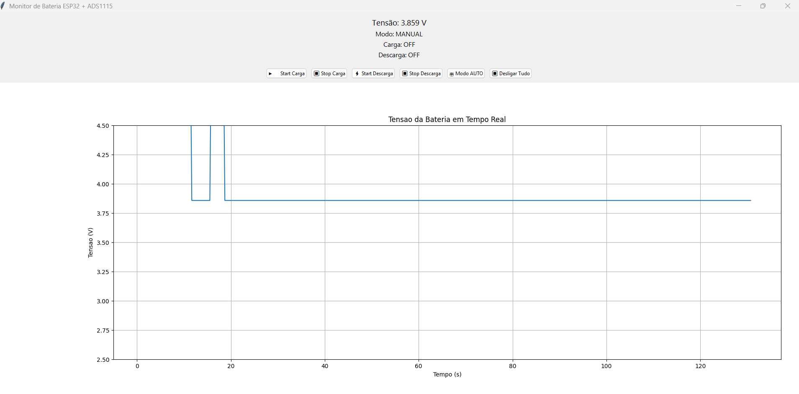

# Interface gráfica de controle e monitoramento da ESP32

- Esta interface comunica com a ESP via porta serial USB;
- O código em python gera uma interface gráfica com botões de controle de ativação de carga e descarga;
- Além disso o código também salva em um um arquivo CSV os valores de tensão lido;

## Monitor

### Pendências:

- Melhorar a forma do modo automático, para que fique desligado os reles quando não estiver nenhuma bateria conectada;
- Resolver o bug da descarga só aparecer no monitoramento do gráfico corretamente quando clicado no botão de stop. Pois quando clica no botão de start discarga a tensão vai para acima de 6v. Talvez removendo o transistor e usando o rele já resolva;
- Resolver porque o rele ainda fica ativo mesmo a ESP recebendo o comando de desligada (LOW). Isso não ocorre quando é clicado no botão de desligar o monitor, ou seja, o rele efetivamente desliga. Por de ser algo relacionado a tempo, pois a esp pode ainda está considerando o modo AUTO e isso faz com que volte o rele ativo (especulação).

